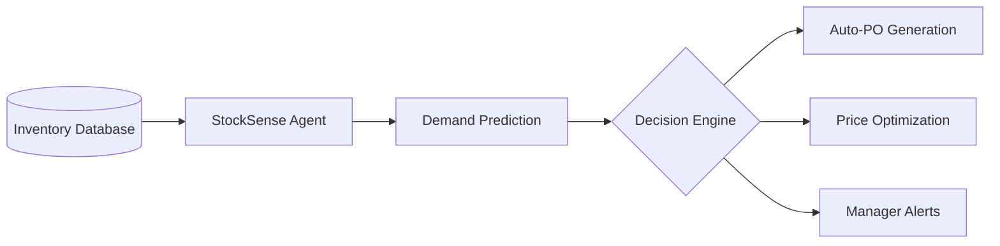

# stocksense-agent
> Eliminating pharmacy inventory waste through autonomous AI agentic monitoring.

   

> *"He(1) stared(2) at(3) the(4) crate(5) of(6) expired(7) medicine,(8) five(9) thousand(10) rupees(11) of(12) pure(13) waste.(14) The(15) ledger(16) was(17) a(18) mess(19) of(20) ink(21) and(22) errors.(23) He(24) engaged(25) StockSense.(26) One(27) scan.(28) One(29) script.(30) The(31) automated(32) alert(33) predicted(34) the(35) stockout(36) before(37) the(38) shelf(39) emptied.(40)"*

## WHAT THIS DOES
StockSense Agent is an autonomous inventory monitoring system for independent pharmacies. It solves the massive waste problem caused by manual auditing and human oversight. By analyzing sales velocity and expiry dates, the agent independently calculates optimal discount pricing and auto-generates restocking orders. It operates on the Fetch.ai Agentverse to coordinate with supplier agents for seamless stock replenishment.

## TECH STACK
| Layer | Technology |
| :--- | :--- |
| Agent Engine | Fetch.ai uAgents Framework |
| Backend | FastAPI / Flask |
| Data Analytics | Pandas / Scikit-Learn |
| Optimization | PuLP (Linear Programming) |
| Database | SQLAlchemy / PostgreSQL |

## QUICK START
```bash
# 1. Clone
git clone https://github.com/ayushjhaa1187-spec/stocksense-agent

# 2. Install
pip install -r requirements.txt

# 3. Run
python src/agent.py
```
Expected output: "[14:32:00] Agent initialized. Starting inventory scan..."

## FEATURES TABLE
| Feature | Why it matters |
| :--- | :--- |
| Expiry Monitoring | 24/7 scanning of inventory databases to detect near-expiry medicines. |
| Demand Prediction | Uses historical sales data to predict exactly how much you need. |
| Smart Discounting | Recommends optimal pricing to clear near-expiry stock before loss. |
| Auto-Restocking | Generates precise purchase orders based on projected demand. |
| Agentverse Integration | Coordinates with supplier agents for automated bulk pricing. |

## HOW IT WORKS

The agent operates on a persistent 4-hour cycle. It performs a retrieval of the local inventory, runs a linear-programming model to determine if discount or restocking is more profitable, and either communicates with the Fetch.ai Agentverse to place a purchase order or triggers a pricing update via the management dashboard.

## PROJECT STRUCTURE
```
stocksense-agent/
├── src/          # Core Fetch.ai uAgent logic and decision engine
├── app/          # Flask-based management dashboard and UI
├── data/         # Sample pharmacy inventory and sales datasets
├── tests/        # Pytest suite for testing expiry calculations
└── requirements.txt # Dependency list for the agent ecosystem
```

## CONFIGURATION
```bash
# .env
AGENT_NAME="Pharmacy_Agent_01"  # Unique identifier for the agent
MIN_DISCOUNT=0.10               # Minimum allowable discount (10%)
SCAN_INTERVAL=14400            # Run scan every 4 hours (in seconds)
```

## ROADMAP
| Feature | Status | Priority |
| :--- | :--- | :--- |
| Expiry Scanners | ✅ Done | High |
| Supplier Negotiation | 🔧 In Progress | Medium |
| Mobile Dashboard | 📋 Planned | Low |

## CONTRIBUTING
We welcome contributions to the prediction logic and supplier agent interfaces.
1. Fork → 2. Branch (`git checkout -b feat/new-strategy`) → 3. PR → 4. Review

## LICENSE + FOOTER
License: MIT
Built by ayushjhaa1187-spec · Give it a ⭐ if it helped you
